# Superset visualisation project

This repository delivers a **ready-to-run data platform** that transforms the raw Twitter-personality data into an interactive, real-time dashboard in **Apache Superset**. The project authomatically sets up everything except the `Superset` connections and the charts, which have to be manually made. 

The architecture integrates batch processing and stream processing for real-time data, satisfying the project’s requirements while keeping the deployment lean (using just one Docker Compose files, with zero manual container setup). Key components and their roles are outlined below:

| Layer                   | Tooling                                                         | Role in the Pipeline                                                             |
|-------------------------|-----------------------------------------------------------------|----------------------------------------------------------------------------------|
| **Batch Storage**       | **Apache Hive**                                                | Holds static user graph (`edges1`), user metadata (`users1`), and MBTI labels (`mbti_labels.csv`).   |
| **Stream Ingestion**    | **Python + Paho-MQTT → Mosquitto → Kafka**                     | Publishes live tweets via MQTT; an MQTT–Kafka bridge forwards them to Kafka.     |
| **Real-time Analytics** | **Apache Druid**                                               | Consumes the Kafka topic and exposes a continuously-updated tweets table.        |
| **Visualization**       | **Apache Superset**                                            | Dashboards that blend static MBTI traits with streaming tweet activity.          |


#### Note:
For the project to run correctly, make sure the `tweets1.json`, `edges1.json`, `users1.json` and `mbti_labels.csv` files are placed inside the `/data` folder.

#### Note:
The project has been tested on a Windows 10 local machine.


---
# 1. Description of the data

The dataset consists of four separate files, each capturing a different aspect of the Twitter user ecosystem. Together, they offer a comprehensive view of user behavior, personality, and social connections.


### 🔗 `edges1.json`
Describes the **network relationships** between users.

Each record includes:
- `follows`: List of user IDs this user follows  
- `is_followed_by`: List of user IDs following this user  
- `id`: Unique identifier of the user  

This file models a directed social graph.


### 👤 `users1.json`
Contains **user profile metadata**.

Each entry includes:
- `screen_name`: The user’s Twitter handle
- `location`: Profile location (free text)
- `verified`: Boolean flag indicating if the account is verified
- `statuses_count`: Total number of tweets posted
- `total_retweet_count`: Cumulative retweets the user has received
- `total_favorite_count`: Cumulative likes the user has received
- `total_hashtag_count`: Total hashtags the user has used
- `total_mentions_count`: Total mentions the user has made
- `total_media_count`: Total media (images, videos) the user has posted
- `id`: Unique user ID

This file provides context about each user's identity and public profile.


### 🧠 `mbti_labels.csv`
Stores **personality classifications** for each user, based on the MBTI model.

Columns:
- `id`: User ID (matching the other files)  
- `mbti_personality`: MBTI type
- `pers_id`: Alternative personality identifier  

This data enables behavioral and psychological analysis.


### 📝 `tweets1.json`
Contains the **tweets authored** by each user.

Each record includes:
- `id`: User ID  
- `tweets`: List of tweet texts (strings) authored by that user  

This file is used primarily for real-time ingestion and streaming analytics.


---
# 2. Description of the project

This section provides an in-depth overview of the project structure, explaining each component and how they connect to each other. The repository is organized as follows:

```

├── combined-docker-compose.yml
├── data
│   ├── edges1.json                           <-- Must be added
│   ├── mbti_labels.csv                       <-- Must be added
│   ├── tweets1.json                          <-- Must be added
│   └── users1.json                           <-- Must be added
├── static-data-pipeline
│   ├── docker-compose-static-data.yml
│   ├── Hive
│   │   ├── Dockerfile_hive
│   │   └── scripts
│   │       ├── convert_to_jsonl.sh
│   │       ├── create_tables.sh
│   │       └── pipeline.sh
│   └── Superset
│       ├── Dockerfile_superset
│       ├── superset_config.py
│       └── scripts
│           └── start_superset.sh
└── stream-data-pipeline
    ├── docker-compose-dynamic-data.yml
    ├── mosquitto.conf
    ├── mqtt-source.json
    └── mqtt_sender
        ├── Dockerfile
        └── mqtt_tweet_sender.py


```

The `data` folder contains the four data files necessary to run the project. The `static-data-pipeline` folder contains the files that handle the static data, and the `stream-data-pipeline` contains the files for the stream data. There is also a combined-docker-compose.yml at the root which can launch the entire stack at once (more on this in the launch section).


## 2.1 static-data-pipeline

The static pipeline is responsible for loading the static datasets (users, edges, MBTI labels) into a queryable database and setting up Superset for visualization. It consists of two main services: `Apache Hive` (the data warehouse for static data) and `Apache Superset` (the visualization layer).

### `Hive` Service (Batch Storage)
The `hive` container usees a custom image defined in `Dockerfile_hive`. This image extends the official `apache/hive:3.1.3` base image and includes additional tools and scripts required to automate the ingestion of static data into `Hive` tables.

When the container starts, it executes the `pipeline.sh` script, which orchestrates the entire ingestion process:

1. `convert_to_jsonl.sh` – Converts the original .json files into .jsonl (JSON Lines) format, which is more suitable for ingestion into `Hive`. To do so, first it makes the JSONL conversion and then it organises the outputs in folders, for better data handling.

2. `create_tables.sh` – Defines the `Hive` tables `edges1`, `users1`, and `mbti_labels`, and loads the converted data into them.


### `Superset` Service (Visualization Layer) 
The `Superset` container is the service that will be used as the power BI tool. `Dockerfile_superset` builds a custom image based on the official `apache/superset:latest` image, extending it with the necessary dependencies and initialization scripts to fully automate the setup of the `Superset` environment:

- **Adds required Python libraries** to connect Superset with `Hive` and `Druid` (for stream data).
- **Includes a startup script** (`start_superset.sh`) that:
  - Initializes the Superset database
  - Creates an admin user (if it doesn't already exist)
  - Starts the web server on port `8088`
- **Loads a basic configuration file** (`superset_config.py`) that sets a secret key for Superset.

Once running, you can access Superset at `http://localhost:8088/` using:

- **Username:** `admin`  
- **Password:** `admin`

From there, Superset can connect directly to Hive to explore the static data and build visualizations (more on this later).


## 2.2 stream-data-pipeline

The stream pipeline handles real-time data ingestion and analytics, focusing on the `tweet` stream. It comprises multiple services working together to generate a live stream of tweets and make it available for analysis in `Superset`. The components of this pipeline are:

### `Zookeeper` and `Kafka` Services (Messaging Infrastructure)

At the core of the streaming system is an `Apache Kafka` message broker (with `Zookeeper` managing its coordination). In our setup, a single `Kafka` broker is deployed (using the `Confluent Kafka` image) along with a `Zookeeper` instance for coordination. `Kafka` is configured to listen on port 9092 and is accessible within the Docker network via the hostname `kafka`. This `Kafka` broker will receive the streaming tweets and act as a buffer between the fast producer (tweets via `MQTT`) and the downstream consumers (`Druid`). `Zookeeper` is a necessary dependency for `Kafka` but does not require direct user interaction.

### `Mosquitto` & `mqtt_sender` Services (MQTT Broker and Producer)

To simulate live tweet data, the project uses an `MQTT` broker (`Eclipse Mosquitto`) and a custom Python container that publishes tweets to this broker. The Mosquitto service runs on port 1883 and is configured (via mosquitto.conf) to allow anonymous connections for simplicity. The broker’s job is to accept incoming “tweet” messages from the producer and make them available for other services (like `Kafka Connect`) to consume.

The `MQTT` producer is implemented in the `mqtt_sender` service. This is a lightweight Python program (mqtt_tweet_sender.py) that continuously reads from tweets1.json and sends out random tweets as if they were live. When started, it connects to the `Mosquitto` broker (host mosquitto on the Docker network) and enters a loop, publishing a new tweet every few seconds. Each published message is a JSON string containing a randomly selected user's ID, a randomly selected tweet text from that user, and a current timestamp. The messages are sent to the `MQTT` topic named "tweets". By adjusting parameters in the script (like the gap between messages), you can control the frequency of the tweet stream. In summary, the `mqtt_sender` is pushing synthetic tweet data into the `Mosquitto` broker in real time.

### `Kafka Connect` (MQTT Source Connector)

To bridge the gap between the `MQTT` world and `Kafka`, the project uses `Kafka Connect` with an `MQTT` source connector. The `kafka-connect` service is based on `Confluent’s Kafka Connect` image and is responsible for streaming data from Mosquitto into Kafka in real-time.

On startup, the `Kafka Connect` container installs the MQTT connector plugin and automatically registers a connector using the configuration file mqtt-source.json. This JSON config specifies how to connect to the `MQTT` broker and where to send the data in Kafka. Essentially, `Kafka Connect` subscribes to the "tweets" topic on the `Mosquitto` broker and, for each incoming message, produces an equivalent message on the `Kafka` topic "tweets". This component is the critical link that forwards the live tweets into `Kafka`, where they become available for consumption by analytics engines like `Druid`.


### `Druid` (Real-Time Analytics Store)

`Apache Druid` is deployed as the real-time analytics database in the stream pipeline. In this project we use a single-container `Druid` service (via a pre-built image) that encapsulates `Druid’s` necessary components. The `Druid` service is configured to join the same Docker network (kafka-net) so that it can reach the `Kafka` broker by name. We expose `Druid’s` internal ports for monitoring and SQL access: notably, port 8888 (which can be used to access `Druid’s` web console). `Druid` is then reachable from `Superset` since the `pydruid` library is installed.


---
# 3. How to launch the project

In order to make everything work and connect all the databases with `superset`, there are several steps that need to be executed.

First, let's start all the containers by running the following command on the project repository:

```
docker-compose -f pipeline-docker-compose.yml up
```

This might take some time. We have to wait until `Superset` and `Druid` are ready. When `Superset` is ready, the following will appear on the terminal:

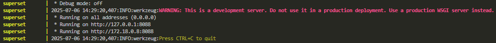

And when `Druid` is ready, the following will appear:

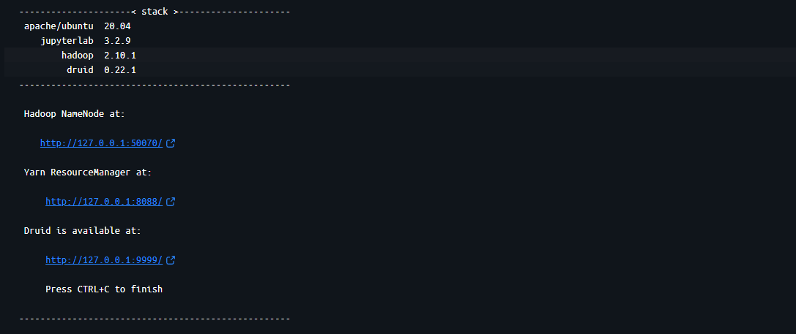

This means that the following ports are available to use (and we need to use them to configure the data):

- http://localhost:8088/ --> `Superset` interface
- http://localhost:9999/ --> `Druid` interface

First, we will configure `Druid`.

## `Druid` configuration

When oppening `druid`, it will appear the following menu:

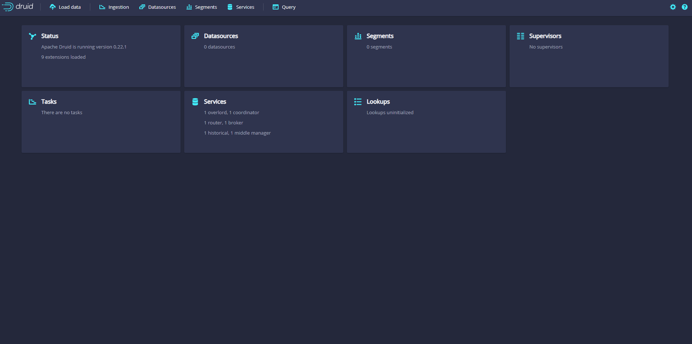

You need to click in **Load data** --> **Start a new spec** and the following will appear:

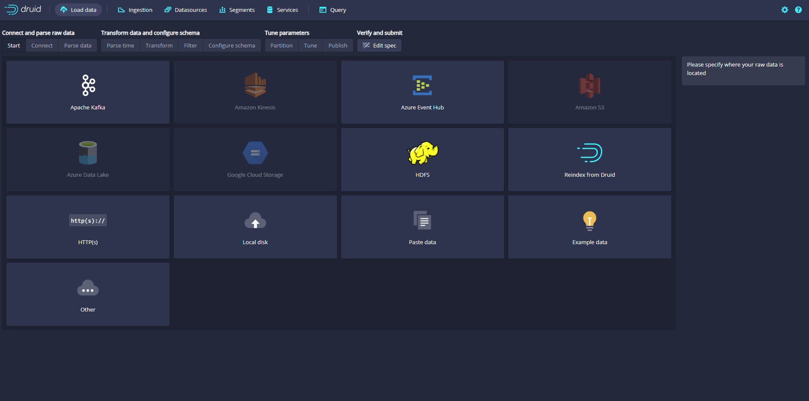

Then, you need to click on **Apache Kafka** --> **Connect data -->** and the following will appear:

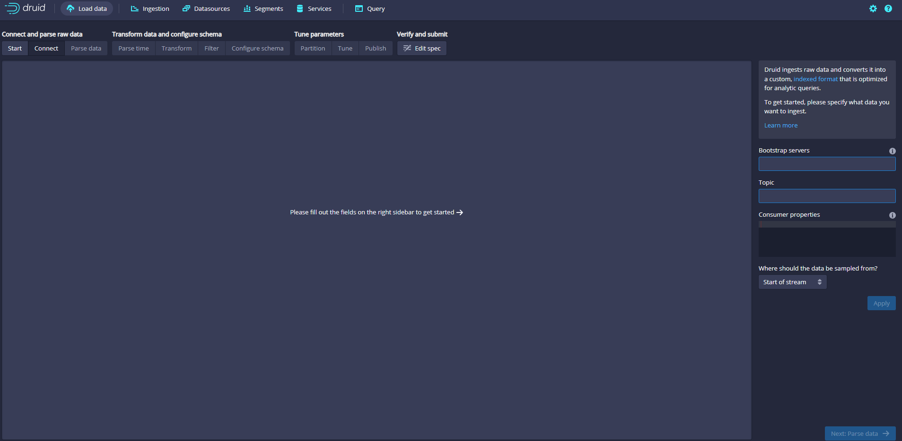

You need to add the following:

- **Bootstrap servers:**  kafka:9092
- **Topic:** tweets

and then click **Apply**. After some time (not too much), it should look something like this:

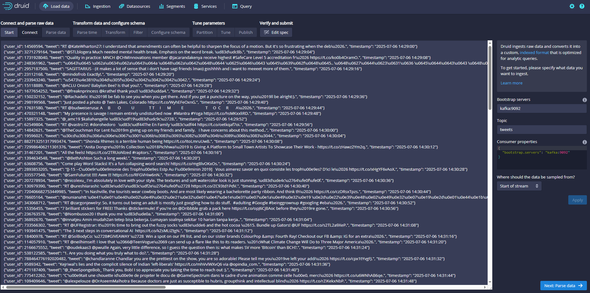

Next, click on the lower-right button (**Next: Parse data -->**) until it does not allow to click anymore. You will be on this menu:

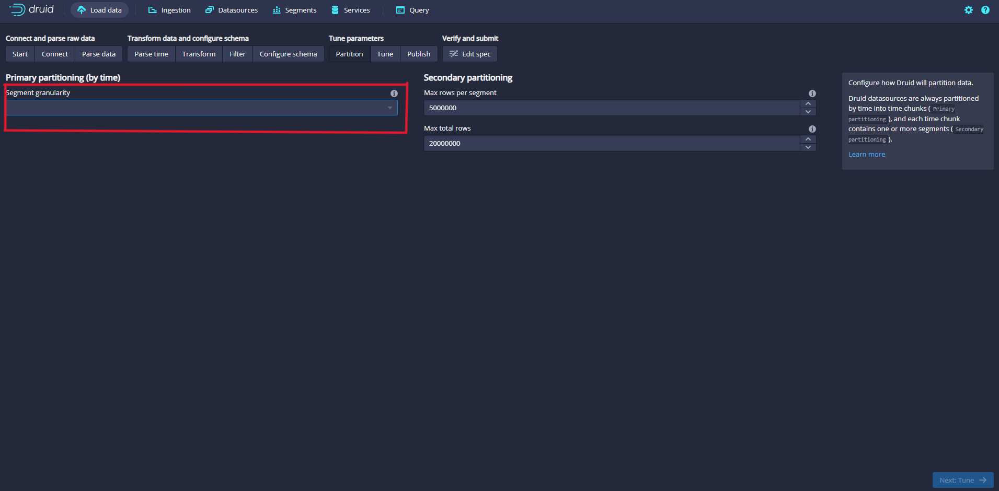

and on the **Segment granularity** scrollable, select **hour**. Then, click **Next: Tune**. After that, select **Use earliest offset** = **True** and click **Next: Publish**:

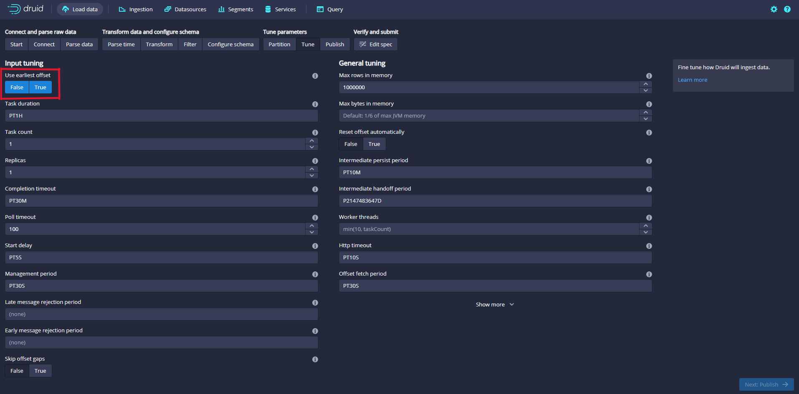

Then, click **Next: Edit spec** and finally click **Submit**. The following should appear:

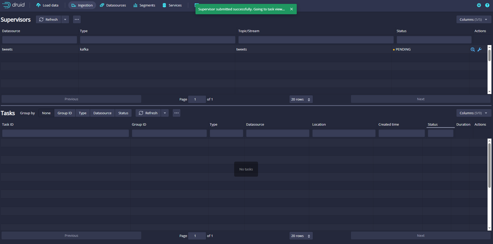

and after a while the **PENDING** will transfomr into **RUNNING**. Now we have `Druid` set up, let's configure `Superset`.


## 3.1 Static data
Firstly we will start with the **static data**. You need to open a `terminal` and go to the folder where the repository or project is located. Then, you need to run the following command:

```
docker-compose -f static-data-pipeline/docker-compose-static-data.yml up
```

This will execute the [docker-compose](static-data-pipeline/docker-compose-static-data.yml) file of the **static data** and set up everything to connect `Hive` with `Superset`. This process will last like a minute, and when it's done the following commands will appear on the `terminal`:

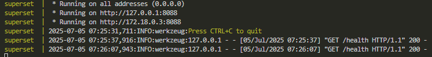

Then, to access `Superset` the port `http://localhost:8088/` should be oppened and introduce the following credentials:

- USERNAME: **admin**
- PASSWORD: **admin**

After that, the `Superset` main page will open. 

Now you need to connect `Apache Hive` to `Superset`. To do so, click on **Settings** --> **Database Connections**:

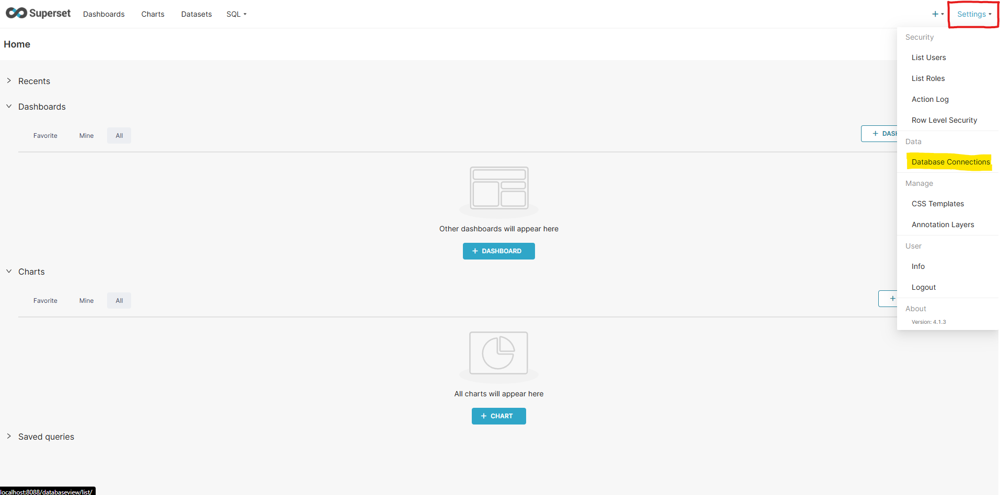

Then, click on **+ DATABASE** and select `Apache Hive` on the **SUPPORTED DATABASES** scrolling window:

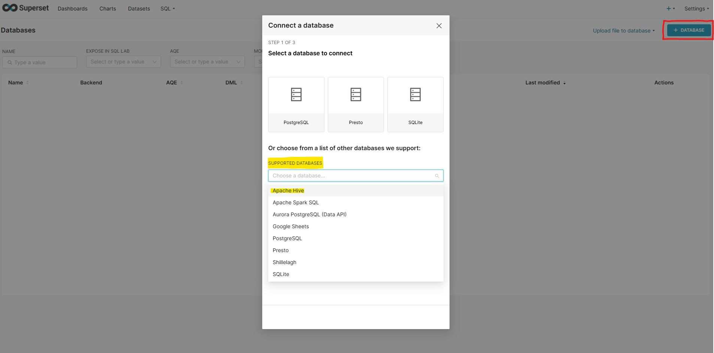

Then, the following will appear:

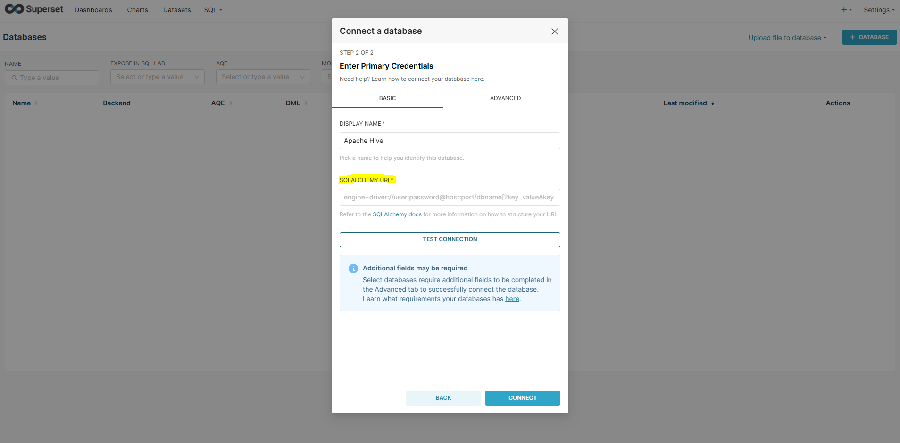

and you need to introduce the following command on **SQLALCHEMI URY**:

```
hive://hive@hive:10000/default
```

After that, click on **CONNECT** and close the **Connect a database** window. 

Now, `Apache Hive` and `Superset` should be connected. To check it, go to **SQL** --> **SQL Lab** and check whether on **SEE TABLE SCHEMA** appear the following three tables:
- edges1
- mbti_labels
- users1

If everything is working correctly, this is what you should see: 

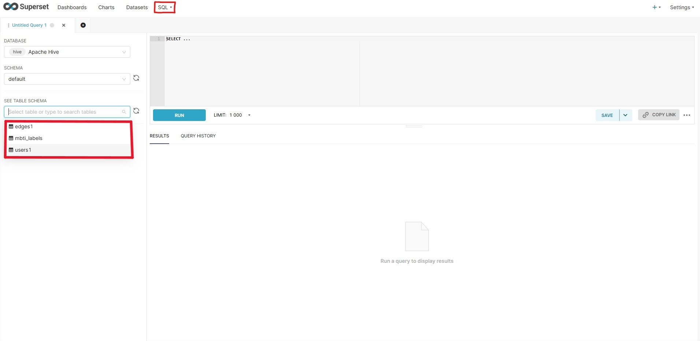

Now the stream data needs to be connected.


## 3.2 Stream data

TO DO

```
docker-compose -f stream-data-pipeline/docker-compose-dynamic-data.yml up
```


---
# 4. Charts and dashboard

Bla bla bla bla


---
# Authors

- Julen Ercibengoa
- Erik


docker-compose -f combined-docker-compose.yml up

hive://hive@hive:10000/default

druid://druid:9999/druid/v2/sql/


## TO CHECK 